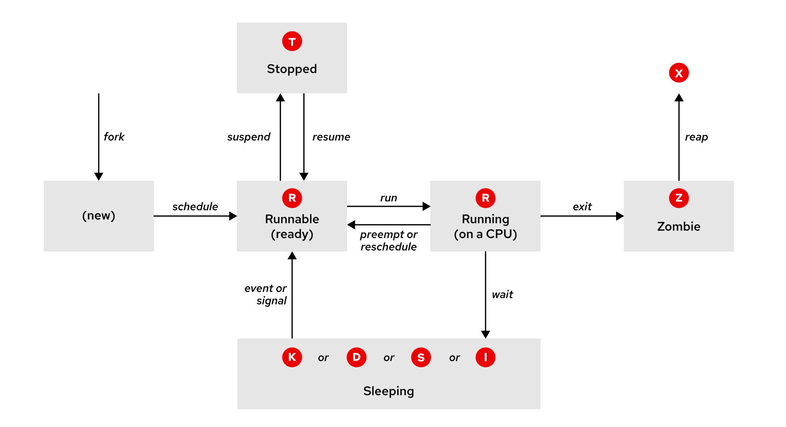

# 🧠 Linux Process Lifecycle Demo (Zombie, Running, Sleeping, etc)

This project demonstrates the **Linux process states** using a custom C application. It's a great tool for labs, workshops, and RHCSA/RHCE-level system internals training.

## 🧰 Features

This demo walks a process through these states:

- `R` (Running on CPU)
- `S` (Sleeping)
- `T` (Stopped)
- `Z` (Zombie)
- Reaped with `wait()`


## 📁 Files

- `process-lifecycle-demo.c`: C program demonstrating process states.

## 🧑‍💻 Prerequisites

- RHEL or any Linux system with GCC
- Terminal access with `ps`, `kill`, `watch`

---

## 🛠️ Step 1: Build the Application

```bash
gcc process-lifecycle-demo.c -o lifecycle
```

---

## 🚀 Step 2: Run the Demo

```bash
./lifecycle
```

In another terminal, monitor it:

```bash
watch -n 0.5 "ps -eo pid,ppid,stat,%cpu,cmd | grep -v grep | grep lifecycle"
```

---

## 🔬 What to Expect

The program will:

1. Fork a child process.
2. Wait for `SIGUSR1` to start CPU-intensive work.
3. Sleep (simulate `S` state).
4. Get stopped and resumed (`T` to `R` again).
5. Exit and become a zombie (`Z`).
6. Be reaped by the parent (`X` done).

You'll see changes like:

```bash
STAT %CPU
R+   99.0    # Running (CPU-bound)
S    0.0     # Sleeping (sleep)
T    0.0     # Stopped (SIGSTOP)
Z    0.0     # Zombie (after exit, before wait())
```

---

## 📦 Optional: Add Memory Usage

Want to see memory too?

```bash
ps -eo pid,ppid,stat,%cpu,%mem,cmd | grep -v grep | grep lifecycle
```

---

## ✅ Clean up

After the demo finishes, all processes are cleaned up. You can run it multiple times.

---

## 📚 Reference



Diagram based on standard Linux process lifecycle states:
- New → Runnable → Running → Sleep/Stop/Zombie/Exit

Created for teaching purposes by [Steven].